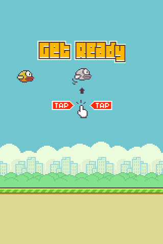
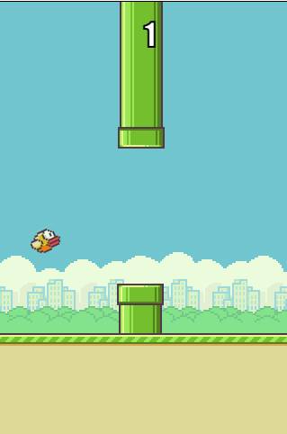
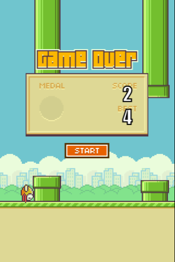

# 🐦 Flappy Bird Game (JavaScript)

A retro-style 2D browser game inspired by **Flappy Bird**, built using pure **HTML, CSS, and JavaScript** with smooth gameplay and classic arcade mechanics.

## 🎮 Live Demo
👉 Play the game **[here](https://reza-hajibabaei01.github.io/flappy-bird-html-css-js/)**

## ✨ Features
- Smooth and responsive gameplay
- Collision detection
- Score tracking system
- Pixel-style graphics
- Built with pure JavaScript (no external libraries)

## 🛠️ Technologies Used
- HTML5
- CSS3
- Vanilla JavaScript

## 🚀 How to Run Locally
1. Clone the repository:
   ```bash
   git clone https://github.com/Reza-Hajibabaei01/flappy-bird-html-css-js.git

## 📸 Screenshot




## 📚 About the Project
- Game mechanics and logic

- DOM manipulation

- Collision detection

- Animations with JavaScript

## 🚧 Future Improvements
- Add sound effects

- Mobile touch support

- Difficulty levels

- Save best score

# 👤 Author

## [Reza Hajibabaei](https://github.com/Reza-Hajibabaei01)